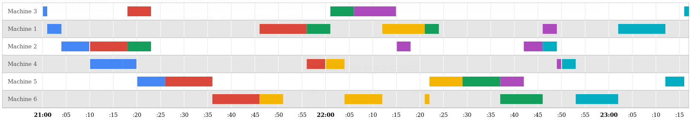

# FjspApp

Este aplicativo renderiza um gráfico no estilo Gantt/Timeline para visualização de uma solução do problema Flexible Job Shop Schedulling 

### Créditos:

Este projeto foi desenvolvido utilizando:

1. angular-cli(https://github.com/angular/angular-cli)
2. googlecharts(https://developers.google.com/chart/) 
3. googlechart-component sugerido em (http://stackoverflow.com/questions/37542408/angular2-google-charts-how-to-integrate-google-charts-in-angular2) 

### Exemplo de saída:
